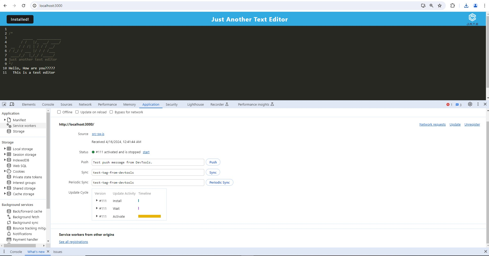

# 19 Progressive Web Applications (PWA): Text Editor

## Your Task

Your task is to build a text editor that runs in the browser. The app will be a single-page application that meets the PWA criteria. Additionally, it will feature a number of data persistence techniques that serve as redundancy in case one of the options is not supported by the browser. The application will also function offline.

To build this text editor, you will start with an existing application and implement methods for getting and storing data to an IndexedDB database. You will use a package called `idb`, which is a lightweight wrapper around the IndexedDB API. It features a number of methods that are useful for storing and retrieving data, and is used by companies like Google and Mozilla.

You will deploy this full-stack application to Render using the [Render Deployment Guide on The Full-Stack Blog](https://coding-boot-camp.github.io/full-stack/render/render-deployment-guide).

**Important**: Make sure your submission includes the `.npmrc` file in this starter code.  This will ensure your application will deploy properly to Render.

## User Story

```md
AS A developer
I WANT to create notes or code snippets with or without an internet connection
SO THAT I can reliably retrieve them for later use
```

## Acceptance Criteria

```md
GIVEN a text editor web application
WHEN I open my application in my editor
THEN I should see a client server folder structure
WHEN I run `npm run start` from the root directory
THEN I find that my application should start up the backend and serve the client
WHEN I run the text editor application from my terminal
THEN I find that my JavaScript files have been bundled using webpack
WHEN I run my webpack plugins
THEN I find that I have a generated HTML file, service worker, and a manifest file
WHEN I use next-gen JavaScript in my application
THEN I find that the text editor still functions in the browser without errors
WHEN I open the text editor
THEN I find that IndexedDB has immediately created a database storage
WHEN I enter content and subsequently click off of the DOM window
THEN I find that the content in the text editor has been saved with IndexedDB
WHEN I reopen the text editor after closing it
THEN I find that the content in the text editor has been retrieved from our IndexedDB
WHEN I click on the Install button
THEN I download my web application as an icon on my desktop
WHEN I load my web application
THEN I should have a registered service worker using workbox
WHEN I register a service worker
THEN I should have my static assets pre cached upon loading along with subsequent pages and static assets
WHEN I deploy to Render
THEN I should have proper build scripts for a webpack application
```
## Table of Contents

1. [Technologies](#technologies)
2. [Description](#description)
3. [Usage](#usage)
4. [Installation](#installation)
5. [Demo](#demo)
6. [Submission](#submission)
7. [License](#license)
8. [Questions](#questions)


<br/>

## Technologies

This application is powered by Webpack (HTML-Webpack-Plugin, Babel, and CSS Loader), Node.js , Express.js and JavaScript. Nodemon  and Concurrently  were utilized as a devDependencies allowing the server to refresh when edits were made to application, and allowing both the front end and back end to be ran on a single command (npm run start:dev).


## Description

Text Editor is a Progressive Web Application (PWA) that runs in the browser, offline and can be installed locally to your machine. The integrated service worker and Cache API's ensure that the application will remain fully functional even without and active internet connection. This application allows the user to access visited pages even if the application is offline.
🚀The application has been deployed to render.com and the URL of the deployed application is [TextEditor](https://pwa-text-editor-ii8k.onrender.com/)


## Usage
Usage of this application is very intuitive, just visit the live URL (https://pwa-text-editor-ii8k.onrender.com/) and start adding notes right away! Users will also notice an install button in the nav bar allowing for the application to be downloaded and used offline. Saving of notes occurs automatically through the IndexedDB; the only thing required is for the user to click out of the window and notes will be persisted whether using the application online or offline


## Installation

 Run the following at the command line
```
    - npm install
    - npm run start:dev 
```
## Demo
Screenshot:


Video:

[walkthru.webm](https://github.com/khoiphan-9194/PWA-Text-Editor/assets/149036903/93a38948-16c3-49f8-9260-93c2de567ef7)

## Submission
 [KhoiPhan-Github repository](https://github.com/khoiphan-9194/PWA-Text-Editor)

## License
[](https://opensource.org/licenses/MIT)

SVG Logo Maker © is licensed under the ISC license.  

For more information regarding the SVG Logo Maker's license, please visit: 
https://opensource.org/licenses/MIT

  
## Questions?
  
### Github:[khoiphan-9194](https://github.com/khoiphan-9194)
  
### Reach Me Via Email: phanminhkhoi91@gmail.com

Thanks for viewing!


